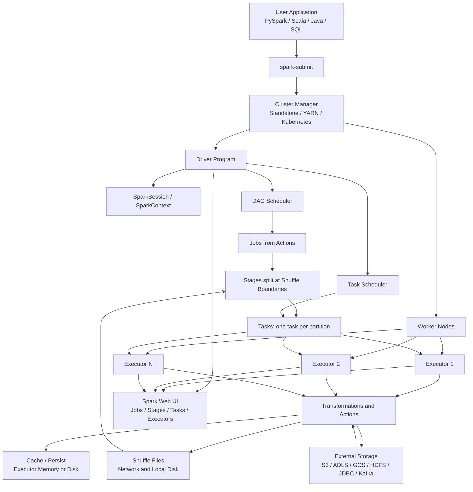
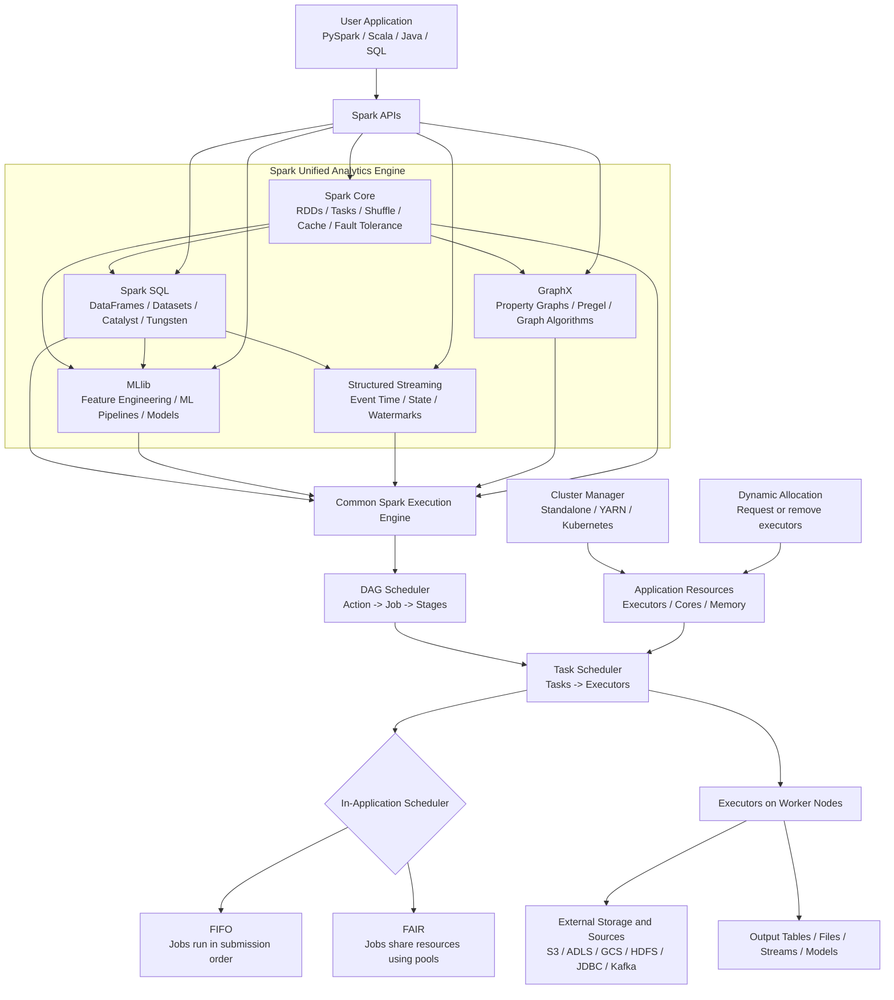
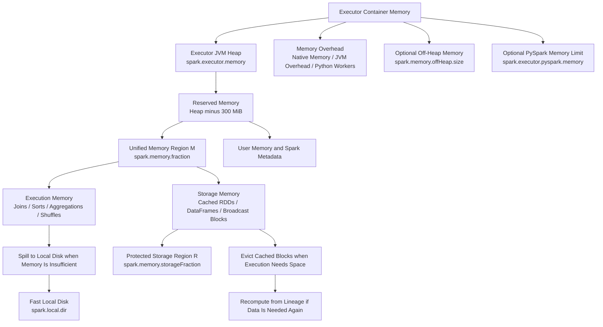

# Spark Revision

---

## Core Spark Concepts

* Spark Architecture - Spark has a driver program, executors, cluster manager, and DAG scheduler that coordinate distributed execution across worker nodes.



### Spark Modules and Scheduling Architecture



* Spark Core - Spark Core provides the foundational execution engine, RDD abstraction, scheduling, memory management, shuffle, caching, and fault tolerance.
* Spark SQL - Spark SQL processes structured data through SQL, DataFrames, and Datasets using the Catalyst optimizer and Tungsten execution engine.
* MLlib - MLlib provides distributed machine-learning algorithms, feature engineering, pipelines, model selection, and evaluation; the DataFrame-based `spark.ml` API is the primary API.
* Structured Streaming - Structured Streaming applies Spark SQL and DataFrame operations incrementally to continuously arriving data with state, event-time windows, and checkpointing.
* GraphX - GraphX provides a distributed property-graph abstraction over RDDs for graph algorithms such as PageRank, connected components, and triangle counting.
* Shared Execution Engine - These modules ultimately use Spark Core’s distributed execution model of partitions, tasks, stages, executors, and shuffles.
* Cluster Manager Scheduler - The cluster manager allocates resources and executors across separate Spark applications; common choices are Standalone, YARN, and Kubernetes.
* DAG Scheduler - The DAG scheduler converts an action into a job and divides the job into stages at shuffle boundaries.
* Task Scheduler - The task scheduler sends individual partition-level tasks to executors and works with the cluster manager to obtain resources.
* FIFO Scheduler - FIFO is the default in-application scheduling mode, where jobs generally receive resources in submission order.
* FAIR Scheduler - FAIR scheduling shares executor resources between concurrent jobs and can use pools, weights, and minimum shares.
* Dynamic Resource Allocation - Dynamic allocation requests executors when tasks are waiting and removes idle executors when demand falls.
* Scheduler Pools - Scheduler pools group jobs so different users or workloads can receive separate scheduling policies and resource shares.
* Scheduling Across Applications vs Within an Application - Cluster managers schedule resources between applications, while Spark’s FIFO or FAIR scheduler manages concurrent jobs inside one application.

## Modern Spark APIs and Data Sources

* Spark Connect - Spark Connect separates the client from the Spark server and sends unresolved logical plans over gRPC, enabling remote DataFrame applications and session isolation.
* Spark Connect Limitations - Spark Connect supports most DataFrame, Column, and SQL APIs but does not provide direct `SparkContext` or RDD access from the client.
* Classic Spark vs Spark Connect - Classic applications run with the driver process directly, while Connect clients communicate with a remote Spark server and receive results through the protocol.
* DataSource V1 - DataSource V1 is the older source API with limited planning, pushdown, catalog, and row-level operation capabilities.
* DataSource V2 - DataSource V2 is the extensible connector API that allows sources to expose catalogs, filter and column pushdown, statistics, partitioning, streaming, and row-level DML.
* TableProvider - TableProvider creates a table from options such as a path or topic and can expose batch or streaming reads and writes.
* CatalogPlugin - CatalogPlugin integrates external catalogs with Spark SQL namespaces, tables, functions, and table lifecycle operations.
* Connector Capabilities - Data sources declare capabilities such as columnar reads, filter pushdown, distribution, ordering, delete, update, merge, and streaming support.
* DataSource V2 Commit Protocol - Batch writes use task-level writers and a driver-level commit or abort so incomplete task output is not made visible as a successful write.
* Row-Level DML - DataSource V2 can implement `DELETE`, `UPDATE`, and `MERGE INTO` through connector-specific row-level operations or read-and-rewrite behavior.
* Table Format vs File Format - Delta Lake, Iceberg, and Hudi are table formats that manage metadata and transactions over storage files; Parquet and ORC are file formats.
* Storage Partition Join - Compatible DataSource V2 tables can report their physical partitioning so Spark may avoid a shuffle during joins or MERGE operations.

## Spark Memory Allocation and Management



* Driver Memory - Driver memory holds the Spark application, query plans, task metadata, and collected results, so large `collect()` calls can cause driver OOMs.
* Executor Memory - Executor memory is the JVM heap assigned to each executor process and is configured with `spark.executor.memory`.
* Memory Overhead - Memory overhead covers non-heap memory such as native allocations, JVM overhead, Python workers, and other processes in the executor container.
* PySpark Memory - `spark.executor.pyspark.memory` can limit Python worker memory; when it is not set, Python memory shares the executor overhead area.
* Off-Heap Memory - Off-heap memory is outside the JVM heap and can be enabled with `spark.memory.offHeap.enabled` and sized with `spark.memory.offHeap.size`.
* Reserved Memory - Spark reserves part of the heap for internal metadata, user objects, and protection against oversized records before allocating unified memory.
* Unified Memory Region (M) - Unified memory is shared by execution and storage, allowing unused storage space to support execution and vice versa under Spark’s eviction rules.
* Execution Memory - Execution memory is used by joins, sorts, aggregations, shuffles, and other temporary computation structures.
* Storage Memory - Storage memory stores cached or persisted RDD/DataFrame partitions, broadcast blocks, and other replicated data.
* Protected Storage Region (R) - The protected storage region contains cached blocks that execution cannot evict below the configured storage boundary.
* User Memory - User memory stores application data structures, user-created objects, and Spark metadata outside the unified execution/storage region.
* `spark.memory.fraction` - This controls the fraction of the heap available to unified execution and storage memory; the default is generally appropriate.
* `spark.memory.storageFraction` - This controls the protected portion of unified memory reserved for storage; increasing it can leave less room for execution.
* Local Disk Memory - Spark uses local disks for shuffle files, spilled execution data, and disk-persisted blocks; fast local disks improve recovery and spill performance.
* Memory Allocation per Executor - Executor memory, executor cores, overhead, and the number of executors must be sized together because more concurrent tasks increase memory pressure.
* Driver Result Size - `spark.driver.maxResultSize` limits serialized results returned by one action and helps prevent the driver from running out of memory.
* Memory Spill - Spark spills intermediate execution data to disk when it cannot fit in execution memory, preserving correctness at the cost of I/O and latency.
* Storage Eviction - Cached blocks may be evicted when execution needs memory, after which Spark can recompute them from lineage unless they were persisted elsewhere.
* Cache and Persist Strategy - Cache only datasets reused by multiple actions and choose a storage level based on memory capacity, recomputation cost, and access speed.
* Serialized Caching - Serialized storage reduces object overhead and memory usage but adds deserialization CPU cost when records are read.
* Kryo Serialization - Kryo is usually faster and more compact than Java serialization, especially for network-heavy or serialized-cache workloads.
* Columnar Caching - Spark SQL caches columnar batches and can compress them based on data statistics to reduce memory usage.
* Broadcast Memory - Broadcast data is copied or made available on each executor, so the broadcast relation must fit safely in executor memory.
* Reduce Task Memory - Increasing shuffle parallelism makes each reduce task process less data and can prevent a single task from exceeding memory.
* Partition Size and Memory - Oversized partitions create large per-task working sets, while very small partitions increase scheduling overhead; partition size must be balanced.
* Garbage Collection - Excessive temporary JVM objects and poorly sized heaps can cause long GC pauses, so compact representations and serialized caching help.
* Memory Fragmentation - Large objects, variable record sizes, and many small allocations can fragment memory and cause failures even when aggregate free memory appears sufficient.
* Memory Leak Prevention - Unpersist unused caches, avoid retaining DataFrame references unnecessarily, and do not keep large driver-side collections across stages.
* Memory Monitoring - Use Spark UI executor metrics, storage pages, task peak memory, spill metrics, GC time, and executor logs to identify memory bottlenecks.
* Memory Optimization Order - First reduce data and shuffles, then tune partitions and joins, then choose caching and serialization, and only afterward adjust memory settings.
* Avoid Blind Memory Tuning - Increasing `spark.memory.fraction` or executor heap without understanding GC, overhead, task concurrency, and spill metrics can make jobs less stable.
* Executor Sizing Trade-off - Fewer large executors provide larger heaps but can increase GC impact, while more moderate-sized executors can improve parallelism and fault isolation.
* OOM During `collect()` - `collect()` transfers the complete dataset to the driver, so use `show()`, `take()`, sampling, or write the result to storage instead.
* OOM During `groupByKey()` - A large group or skewed key can exceed one task’s working memory, so prefer map-side aggregation, salting, and higher shuffle parallelism.

* RDD (Resilient Distributed Dataset) - RDD is a fault-tolerant distributed collection of data that supports lazy transformations and parallel processing.
* DataFrame - A DataFrame is a distributed, schema-aware collection of rows with named columns, optimized for SQL-like analytics.
* Dataset - A Dataset is a strongly typed distributed collection that combines the safety of typed APIs with Spark SQL optimization.
* Lazy Evaluation - Spark does not execute transformations immediately; it builds a logical plan and runs only when an action triggers execution.
* Transformations vs Actions - Transformations create new datasets without immediate execution, while actions trigger jobs and return results to the driver.
* Narrow vs Wide Transformations - Narrow transformations keep data within a partition, while wide transformations require shuffle and regroup data across partitions.
* DAG (Directed Acyclic Graph) - Spark builds a DAG of stages and tasks from logical operations so it can optimize and execute work efficiently.
* Partitions - Partitions divide data into smaller chunks so work can be processed in parallel across executors.
* Executor, Driver, Worker, Task, Stage, Job - These are the core building blocks of a Spark application and execution lifecycle.
* Cluster Manager - Spark uses a cluster manager for resource allocation; current deployments commonly use Standalone, YARN, or Kubernetes, while Mesos is a legacy option found in older deployments.
* Local Mode vs Cluster Mode - Local mode runs Spark on a single machine for testing, while cluster mode distributes work across multiple machines.
* Shuffling - Shuffling redistributes data across partitions for operations like groupBy, join, and reduceByKey, and it is expensive.
* Caching and Persistence - Caching keeps intermediate data in memory or disk so repeated reads avoid recomputation.
* Broadcast Variables - Broadcast variables distribute small lookup tables to all executors once, avoiding repeated shipping of data per task.
* Accumulators - Accumulators are write-only distributed counters used for metrics, validation, and debugging in Spark jobs.
* Lineage - Spark tracks lineage of transformations so it can recompute lost partitions from source data without storing full copies.
* Fault Tolerance - Spark achieves fault tolerance by recomputing lost partitions from the original data lineage and persisted state.
* Spark UI - The Spark UI shows jobs, stages, tasks, storage, executor health, and shuffle metrics for troubleshooting and tuning.
* SparkSession vs SparkContext - SparkSession is the modern entry point for Spark SQL and DataFrame APIs, while SparkContext is the lower-level core context.
* SparkConfig - SparkConfig defines runtime behavior such as memory, parallelism, shuffle, and execution settings.
* Application Master vs Driver - In cluster deployments, the driver orchestrates the application while the cluster manager allocates executors.

## Spark Architecture and Execution Model

* Driver Program - The driver program runs user code, creates SparkSession, and coordinates task scheduling across executors.
* Executor - An executor runs tasks on worker nodes and stores data for in-memory or on-disk computation.
* Task - A task is the smallest unit of Spark work assigned to a single partition on an executor.
* Stage - A stage is a set of tasks that can run without a shuffle boundary, usually grouped by dependency structure.
* Job - A job is launched by an action and consists of multiple stages executed together.
* DAG Scheduler - The DAG scheduler breaks a job into stages and orders them based on dependencies.
* Task Scheduler - The task scheduler assigns each stage's tasks to available executors in the cluster.
* Data Locality - Data locality prioritizes processing data on the same machine where it is stored to reduce network I/O.
* Memory Management - Spark uses heap memory for execution, storage, user data, and shuffle memory, and must balance these carefully.
* Tungsten - Tungsten is Spark’s execution engine optimization for memory management, binary processing, and efficient CPU use.
* Catalyst Optimizer - Catalyst is Spark SQL’s query optimizer that performs rule-based and cost-based optimization on DataFrame plans.
* Whole-Stage Code Generation - Spark generates optimized code for query execution to reduce overhead and improve CPU efficiency.
* Serialization - Serialization converts data for network transfer and shuffle, and choosing efficient serializers reduces cost and latency.
* Java Virtual Machine (JVM) Overhead - Spark workloads running on JVMs can suffer from overhead, so tuning memory and task parallelism matters.
* Resource Allocation - Executor cores, memory, number of executors, and dynamic allocation determine how efficiently Spark uses cluster resources.
* Dynamic Allocation - Dynamic allocation automatically scales executors up and down based on workload so resource usage stays efficient.
* Standalone, YARN, Kubernetes - Spark can run under different cluster managers depending on the environment and operational model.
* Client Mode vs Cluster Mode - Client mode runs the driver on the submitting machine, while cluster mode runs the driver inside the cluster.
* Spark Web UI - The Spark UI is critical for diagnosing slow jobs, skew, task failures, and inefficient shuffles.

## Spark Data Sources and Ingestion

* File Formats - CSV, JSON, Parquet, ORC, Avro, Delta, Iceberg, and Hudi are common file formats for Spark ingestion and storage.
* Parquet - Parquet is a columnar file format optimized for analytical workloads, compression, and selective reads.
* Avro - Avro is a row-based format that supports schema evolution and is useful for streaming and event data.
* ORC - ORC is a columnar format optimized for Hive-like workloads and efficient query performance.
* JSON - JSON is flexible but less efficient than Parquet for large analytical workloads because it is verbose and schema-light.
* CSV - CSV is simple and human-readable but less efficient than columnar formats for analytic processing.
* Delta Lake - Delta Lake adds ACID transactions, schema evolution, and versioning to data lake storage in Spark workloads.
* Apache Iceberg - Iceberg provides table formats for large-scale analytics with schema evolution and partition pruning.
* Apache Hudi - Hudi is a data lake table format supporting incremental ingestion, upserts, and efficient table maintenance.
* Reading Files in Spark - Spark reads files using DataFrameReader or SparkSession.read, and can handle CSV, JSON, parquet, ORC, and warehouse formats.
* Writing Files in Spark - Spark writes data using DataFrameWriter, supporting partitioned writes, file formats, and compression choices.
* Partitioning by Column - Partitioning by a frequently filtered column reduces scan volume and improves query speed.
* Bucketing - Bucketing groups rows by hash to improve join performance and pruning for large tables.
* File Layout and Compression - Compression and layout choices like snappy, zstd, and parquet row groups affect speed and storage cost.
* Source System Extraction - Spark can ingest from S3, ADLS, GCS, HDFS, JDBC, Kafka, and REST APIs depending on architecture.
* JDBC Read/Write - Spark can read and write data from databases using JDBC connectors to support ETL and batch synchronization.
* Streaming Sources - Kafka, Kinesis, Event Hubs, and Pub/Sub are common streaming sources for Spark Structured Streaming workloads.
* Schema Inference - Spark can infer schema automatically but explicit schema definition is safer for production pipelines.
* Schema Evolution - Schema evolution allows adding or changing columns without breaking downstream reads or writes.
* Data Contracts - Data contracts define expected schema, semantics, and quality requirements between producers and consumers.
* Delta/Parquet Merge and Upsert - Upsert patterns allow insert/update logic using merge operations for slowly changing data.
* Staging and Raw Layer - In lakehouse architectures, raw data is often stored before transformation into curated or trusted layers.

## Spark Data Processing and Transformations

* map() - map() applies a function to each row or element and returns a transformed dataset.
* filter() - filter() selects rows that match a given condition and reduces data volume early.
* flatMap() - flatMap() transforms each element into zero or more outputs, useful for exploding nested data.
* select() - select() projects specific columns and is essential for reducing payload size and reading only needed fields.
* withColumn() - withColumn() adds or replaces columns using expression logic or UDFs.
* drop() - drop() removes columns that are no longer needed from a DataFrame.
* distinct() - distinct() removes duplicate records across a DataFrame.
* groupBy() - groupBy() groups rows by key for aggregation and summarization.
* agg() - agg() applies aggregate functions like sum, avg, min, max, count, and custom expressions.
* join() - join() combines two DataFrames using common keys and supports inner, left, right, outer, and semi/anti joins.
* union() - union() stacks rows from two DataFrames with the same schema, often used in incremental pipelines.
* unionByName() - unionByName() combines DataFrames with same names even if order differs, which is useful with evolving schemas.
* sort(), orderBy(), sortWithinPartitions() - These sort data logically and help control output ordering and partition layout.
* repartition() - repartition() changes the number of partitions and often triggers a full shuffle.
* coalesce() - coalesce() reduces the number of partitions without a full shuffle and is useful after filtering.
* cache() and persist() - cache() and persist() store intermediate DataFrames in memory or disk for reuse across multiple actions.
* explode() - explode() expands array or map values into multiple rows for unnesting nested data.
* pivot() - pivot() rotates rows into columns, often used for reporting and crosstab-style analytics.
* window() - window() enables aggregate calculations across rows in a sliding or time-based window.
* UDF (User Defined Function) - UDFs let you apply custom Python or Scala logic, but they can be slower than native Spark SQL expressions.
* mapPartitions() - mapPartitions() applies logic per partition and can reduce per-row function overhead for large workloads.
* foreach() - foreach() runs side effects for each row and is commonly used for writing to external systems or logging.
* reduceByKey() - reduceByKey() aggregates values for each key efficiently with a combine step before shuffle.
* aggregateByKey() - aggregateByKey() supports custom aggregation logic with a zero value and combine function.
* countByValue(), count(), sum() - These are classic actions for quick counts and aggregate checks during testing and validation.
* collect() vs take() vs show() - collect() brings all data to driver memory, take() returns some rows, and show() previews a small sample.
* checkpoint() - checkpoint() stores intermediate state on disk and is especially useful in iterative or long lineage workloads.

## Spark SQL and DataFrame APIs

* SparkSession - SparkSession creates DataFrames, registers temporary views, and manages SQL execution within Spark.
* DataFrameReader - DataFrameReader reads structured data from various sources and configures schema and options.
* DataFrameWriter - DataFrameWriter writes DataFrames to sinks such as Parquet, Delta, JDBC, and object storage.
* SQL Query Execution - Spark SQL parses, analyses, optimizes, and executes SQL statements using the Catalyst engine.
* Catalyst Optimizer - Catalyst rewrites queries into efficient logical and physical plans using predicate pushdown, projection pruning, and join optimization.
* Tungsten Execution Engine - Tungsten improves memory use and CPU efficiency for Spark SQL and DataFrame execution.
* Temporary Views and Global Views - Temporary views allow SQL queries over DataFrames without persisting tables in a catalog.
* Hive Metastore Integration - Spark can read and write Hive tables through the Hive metastore to integrate with warehouse workloads.
* Joins in SQL - Spark supports inner, outer, left, right, semi, anti, and cross joins for analytics workloads.
* Join Optimization - Spark chooses join strategies based on data size, shuffle costs, and partitioning to minimize network transfer.
* Broadcast Join - Broadcast join sends a small table to all executors to avoid a large shuffle for small-dimension tables.
* Sort Merge Join - Sort merge join sorts both sides and combines rows efficiently for large equi-joins.
* Shuffle Hash Join - Shuffle hash join partitions both sides by key and hashes matching rows together.
* Window Functions - ROW_NUMBER(), RANK(), DENSE_RANK(), LAG(), LEAD(), SUM() OVER() are standard Spark SQL analytic functions.
* CTEs and Subqueries - CTEs and subqueries simplify complex SQL logic and make business logic easier to reason about.
* NULL Handling - Spark SQL uses functions like coalesce(), isNull(), when(), and nullif() to handle missing values correctly.
* Case Statements and Expressions - CASE WHEN and SQL expressions support conditional transformations inside Spark SQL.
* UDFs and Pandas UDFs - UDFs allow custom logic, while Pandas UDFs provide vectorized operations for performance-sensitive work.
* Partition Pruning - Partition pruning skips irrelevant file partitions based on filter predicates to reduce read volume.
* Predicate Pushdown - Predicate pushdown pushes filters closer to the source so unnecessary rows are filtered earlier.
* Project Pruning - Project pruning reads only the columns needed instead of full-row materialization.
* Query Plans and explain() - explain() shows the logical, physical, and optimized execution plan for debugging and tuning.
* DataFrame Caching - Caching DataFrames with cache() is essential for iterative transformations and repeated reads.
* Temporary Tables and Catalog - Spark SQL can register tables in a catalog so they can be queried repeatedly by business logic.

## Functional Examples - Spark SQL Operations

The following PySpark examples use the DataFrame API and Spark SQL for common interview operations.

```python
from pyspark.sql import SparkSession, Window
from pyspark.sql import functions as F

spark = SparkSession.builder.appName("SparkSqlExamples").getOrCreate()

employees = spark.createDataFrame(
	[
		(1, "Asha", 10, 85000, "2024-01-10"),
		(2, "Ben", 20, 72000, "2023-06-15"),
		(3, "Chen", 10, 91000, "2022-03-20"),
		(4, "Dina", 30, 68000, "2024-02-01"),
	],
	["employee_id", "name", "department_id", "salary", "joined_date"],
).withColumn("joined_date", F.to_date("joined_date"))

departments = spark.createDataFrame(
	[(10, "Engineering"), (20, "Finance"), (30, "Sales")],
	["department_id", "department_name"],
)

# Select, filter, derive columns, and sort.
high_earners = (
	employees
	.select("employee_id", "name", "department_id", "salary")
	.filter(F.col("salary") >= 80000)
	.withColumn("salary_band", F.when(F.col("salary") >= 90000, "senior").otherwise("standard"))
	.orderBy(F.col("salary").desc())
)

# Aggregate by department.
department_summary = (
	employees
	.groupBy("department_id")
	.agg(
		F.count("employee_id").alias("employee_count"),
		F.avg("salary").alias("average_salary"),
		F.max("salary").alias("maximum_salary"),
	)
	.orderBy("department_id")
)

# Join fact-like employee data with a dimension-like department table.
employee_details = employees.join(departments, "department_id", "left")

# Broadcast a small dimension table to avoid a large shuffle join.
broadcast_details = employees.join(F.broadcast(departments), "department_id", "left")

# Semi join keeps employees that have a matching department without adding columns.
valid_employees = employees.join(departments, "department_id", "left_semi")

# Anti join finds employees whose department key is missing.
invalid_employees = employees.join(departments, "department_id", "left_anti")

# Rank employees within each department using a window function.
department_window = Window.partitionBy("department_id").orderBy(F.col("salary").desc())
ranked_employees = employees.withColumn("salary_rank", F.row_number().over(department_window))

# Use lag and lead to compare rows within each department.
salary_comparison = (
	employees
	.withColumn("previous_salary", F.lag("salary").over(department_window))
	.withColumn("next_salary", F.lead("salary").over(department_window))
)

# Deduplicate records using a business key and ordering rule.
latest_by_employee = (
	employees
	.withColumn("row_number", F.row_number().over(Window.partitionBy("employee_id").orderBy(F.col("joined_date").desc())))
	.filter(F.col("row_number") == 1)
	.drop("row_number")
)

# Register a temporary view and run Spark SQL.
employee_details.createOrReplaceTempView("employee_details")
sql_result = spark.sql("""
	WITH department_stats AS (
		SELECT
			department_name,
			COUNT(*) AS employee_count,
			ROUND(AVG(salary), 2) AS average_salary
		FROM employee_details
		GROUP BY department_name
	)
	SELECT department_name, employee_count, average_salary
	FROM department_stats
	WHERE employee_count >= 1
	ORDER BY average_salary DESC
""")

# Inspect the physical plan before tuning.
sql_result.explain("formatted")

# Preview safely; avoid collect() unless the result is known to be small.
sql_result.show(truncate=False)
```

* `select()` - Projects only required columns and helps Spark apply column pruning.
* `filter()` / `where()` - Keeps rows matching a condition and should usually be applied early.
* `withColumn()` - Adds or replaces a column using a Spark SQL expression.
* `groupBy().agg()` - Performs distributed aggregations such as count, sum, average, min, and max.
* `join()` - Combines DataFrames using matching keys and a selected join type.
* `left_semi` - Returns rows from the left side that have a match on the right without returning right-side columns.
* `left_anti` - Returns rows from the left side that have no match on the right and is useful for data-quality checks.
* `broadcast()` - Marks a small relation for broadcast join to avoid shuffling the large relation.
* `Window.partitionBy().orderBy()` - Defines the grouping and order used by ranking, lag, lead, and rolling calculations.
* `row_number()` - Assigns a unique sequence within each window and is commonly used for latest-record deduplication.
* `createOrReplaceTempView()` - Exposes a DataFrame as a temporary SQL table for the current Spark session.
* CTE (`WITH`) - Breaks complex SQL transformations into named, readable intermediate queries.
* `explain("formatted")` - Displays the physical plan so scans, exchanges, joins, and filters can be inspected before production execution.
* `show()` vs `collect()` - `show()` previews rows on the driver, while `collect()` transfers the entire result and can cause driver OOM.

## Spark Performance Tuning and Optimization

* Data Skew - Data skew occurs when certain keys have far more rows than others, causing some tasks to become bottlenecks.
* Salting - Salting adds a random key to skewed data so work spreads more evenly across partitions.
* Repartition vs Coalesce - repartition() changes partition count and triggers shuffle, while coalesce() reduces partitions without a full shuffle.
* Shuffle Optimization - Shuffle performance depends on partition counts, spill thresholds, serialization, and network bandwidth.
* Broadcast Optimization - Broadcasting small dimension tables reduces shuffle cost in join-heavy pipelines.
* Join Strategy Selection - Spark chooses join strategies based on table sizes, keys, and whether data is already partitioned.
* Partition Count Tuning - Too few partitions underutilize resources, while too many partitions increase overhead and scheduling cost.
* Executor Memory Tuning - Executor memory is divided among execution, storage, shuffle, and overhead, so tuning is critical for stable performance.
* Spill to Disk - When memory is insufficient, Spark spills intermediate data to disk, which increases latency but preserves correctness.
* Shuffle File Management - Shuffle writes intermediate files and can become a major I/O bottleneck in large jobs.
* Cache Only Hot Data - Caching must be used strategically on frequently reused datasets; caching too much can waste memory.
* Avoiding Wide Transformations - Reducing unnecessary wide transformations like large joins and groupBy can dramatically improve runtime.
* File Format Tuning - Columnar formats such as Parquet and Delta reduce I/O and improve analytical scan performance.
* Filter Early and Project Early - Filtering before joins and selecting only needed columns reduces resource usage and improves performance.
* Expression Pushdown - Spark pushes functions and conditions to the source as early as possible to improve efficiency.
* AQE (Adaptive Query Execution) - AQE dynamically re-optimizes queries at runtime based on actual data statistics and runtime conditions.
* AQE Coalesce Partitions - AQE can merge small partitions after filtering to reduce overhead and improve parallelism.
* AQE Skew Join - AQE detects skewed join keys and can split or optimize skewed partitions during execution.
* Optimize Writes - Writing with the right file size, partitioning, and compression reduces downstream read costs and storage overhead.
* Serialization Tuning - Using efficient encoders/serializers and compact data types reduces memory and shuffle overhead.
* Garbage Collection Tuning - Poor GC behavior can hurt Spark jobs, so memory sizing and object lifecycle management matter.
* Spill and OOM Prevention - Memory pressure, skew, and excessive shuffles can trigger OOMs, so monitoring and tuning are essential.
* Optimization Workflow - Start with the Spark UI and `explain()` plan, identify the slowest stage, determine whether the bottleneck is CPU, memory, disk, network, skew, or input files, then change one variable and remeasure.
* Cost-Based Optimizer (CBO) - CBO uses table and column statistics to improve join ordering and physical plan selection, so accurate statistics can improve complex SQL workloads.
* Table and Column Statistics - Statistics such as row counts, table size, and column distributions help Spark estimate cardinality and choose better joins.
* Dynamic Partition Pruning - Spark can use join-side filter values at runtime to skip irrelevant partitions from the fact-table scan.
* Native Spark Expressions - Built-in SQL functions are usually faster than Python UDFs because Spark can optimize, push down, and code-generate native expressions.
* Avoid Excessive `withColumn()` Chains - Many repeated projections can create large plans, so group related expressions or use a single `select()` when practical.
* Predicate and Projection Pushdown - Filter rows and select columns as close to the source as possible to reduce I/O, network transfer, and memory usage.
* Small-File Problem - Too many small files increase listing, scheduling, metadata, and open-file overhead, so compact output files and control write parallelism.
* File Size and Partition Design - Choose data partitions for common filters and target reasonably sized files rather than creating a partition for every distinct value.
* Dynamic Partition Overwrite - Overwrite only affected partitions for incremental loads instead of rewriting an entire partitioned table.
* Bucketing Optimization - Bucketing compatible tables by join keys can reduce shuffle for repeated joins, but it adds write and maintenance cost.
* Join Reordering - Reorder joins so filters and selective small relations reduce the amount of data entering later joins.
* Join Key Preparation - Normalize data types, trim invalid keys, and remove unnecessary duplicates before joins to avoid missed matches and inflated shuffle volume.
* Broadcast Threshold - Use automatic or explicit broadcast joins only when the relation safely fits in executor memory and the broadcast cost is justified.
* Locality Optimization - Keep data and compute close together and avoid unnecessary movement from remote storage or poorly placed cached blocks.
* Speculative Execution - Speculation can relaunch unusually slow tasks caused by bad nodes, but it should be used carefully when tasks have non-idempotent side effects.
* Stage-Level Scheduling - Different stages can request different resource profiles, such as CPU for ETL and GPUs for machine-learning stages, when the cluster manager supports it.
* Dynamic Allocation Tuning - Configure minimum, initial, and maximum executors with backlog and idle timeouts so scaling does not create excessive startup or churn overhead.
* Shuffle Compression - Compressing shuffle and spill data reduces network and disk usage, trading additional CPU for lower I/O cost.
* Push-Based Shuffle - Push-based shuffle can merge mapper outputs on remote shuffle services and reduce small random reads for large shuffle workloads where supported.
* Streaming Optimization - Keep streaming state bounded with watermarks, limit stateful operations, tune trigger intervals, and monitor batch duration against the trigger interval.
* Output Optimization - Control output partition counts, avoid unnecessary `repartition()` before writes, and compact files after high-frequency incremental writes.
* Optimization Trade-offs - A faster job may use more memory, CPU, or storage, so evaluate runtime, reliability, cluster cost, and downstream read performance together.
* `EXPLAIN COST` - `EXPLAIN COST` or `explain(mode="cost")` shows optimizer estimates so incorrect cardinality or table-size statistics can be found.
* `ANALYZE TABLE` - `ANALYZE TABLE` collects catalog statistics that can improve cost-based join ordering and physical plan selection.
* Join Hints - `BROADCAST`, `MERGE`, `SHUFFLE_HASH`, and `SHUFFLE_REPLICATE_NL` hints influence join strategy, but Spark may ignore a hint when the join type cannot support it.
* AQE Runtime Re-optimization - AQE uses actual runtime statistics to coalesce shuffle partitions, convert join strategies, split skewed partitions, and use local shuffle readers.
* AQE Default - AQE has been enabled by default since Spark 3.2, but its individual rules and workload impact should still be verified in the SQL UI.
* Storage Partition Join Optimization - DataSource V2 partitioning can eliminate Exchange nodes before a compatible join, reducing shuffle without manually repartitioning both inputs.
* Partitioning Hints - SQL hints such as `COALESCE`, `REPARTITION`, `REPARTITION_BY_RANGE`, and `REBALANCE` control partition counts and output file layout.
* File Scan Tuning - `spark.sql.files.maxPartitionBytes`, `openCostInBytes`, and file partition limits influence how file inputs are grouped into tasks.

## Spark Streaming and Real-Time Data

* Structured Streaming - Structured Streaming is Spark’s scalable API for processing continuous data as a stream of rows with SQL semantics.
* Micro-batch Processing - Spark Structured Streaming usually processes data in micro-batches, balancing low latency and reliability.
* Event Time Processing - Event time uses timestamps from source data instead of processing time to handle late or out-of-order events.
* Processing Time vs Event Time vs Ingestion Time - These are different notions of time used to reason about data freshness, semantics, and delay.
* Watermarking - Watermarking tracks how late data is tolerated before it is considered too old for a windowed aggregation.
* Stateful Aggregation - Stateful aggregation keeps intermediate results across micro-batches for operations such as counts and rolling windows.
* Windowing - Tumbling, hopping, sliding, and session windows support different ways of aggregating streaming data over time.
* DropDuplicates and deduplication - Streaming pipelines often deduplicate events using keys and watermark windows to prevent double-processing.
* Checkpointing - Checkpointing saves streaming state so jobs can recover after failure and continue processing correctly.
* Kafka Integration - Spark can read from Kafka topics and write to Kafka or other sinks using structured streaming.
* Output Modes - Append, Update, and Complete are output modes for structured streaming depending on the processing pattern.
* Trigger Intervals - Trigger intervals define how frequently micro-batches are processed and directly affect latency and throughput.
* Late Data Handling - Late data can be accepted within watermarks or dropped when it exceeds allowed delay thresholds.
* Backpressure - The classic backpressure setting belongs mainly to legacy DStreams; Structured Streaming typically uses trigger intervals, source rate limits, and available processing capacity.
* Exactly Once Semantics - Spark Structured Streaming aims to provide end-to-end exactly-once semantics when writing to supported sinks.
* State Store - State store preserves intermediate aggregate results across micro-batches and supports recovery and reprocessing.
* Streaming ETL - Streaming ETL transforms data in motion for immediate filtering, cleansing, and loading into downstream systems.
* Fault Tolerance in Streaming - Streaming jobs rely on checkpointing, idempotent writes, and replayable sources to recover safely.
* Streaming Rate Limiting - Use source options such as Kafka `maxOffsetsPerTrigger`, file `maxFilesPerTrigger`, or `maxBytesPerTrigger` to control micro-batch input size.
* Trigger Types - Default processing, fixed `processingTime`, `availableNow`, deprecated `once`, and experimental continuous triggers provide different latency and cost trade-offs.
* Available-Now Trigger - `availableNow` processes all data available at start time in multiple scalable micro-batches and then stops.
* Stream-Static Join - A stream-static join is generally not stateful because the static side is already complete, although the static table still needs to be refreshed intentionally.
* Stream-Stream Join - Stream-stream joins retain state from both inputs and require watermarks plus event-time constraints to bound state and handle late data.
* Streaming State Store - The state store is a versioned key-value store used by streaming aggregations, deduplication, joins, and arbitrary stateful operations.
* HDFS-Backed State Store - The default state store keeps active state in memory and persists versions to checkpoint-compatible storage.
* RocksDB State Store - RocksDB can move large streaming state out of the JVM heap into native memory and local disk to reduce JVM garbage-collection pressure.
* `transformWithState` - `transformWithState` is the preferred Spark 4.0 API for complex arbitrary stateful processing, replacing many legacy state patterns.
* Multiple Watermarks - Spark derives a global watermark across inputs; the default minimum is safer, while maximum advances faster but may drop more late data.
* Streaming Query Progress - `lastProgress`, `recentProgress`, and `status` expose input rate, processing rate, latency, watermark, state rows, and batch progress.
* Streaming Checkpoint Compatibility - Changing stateful operator schemas, grouping keys, join structure, or state-store configuration may make an existing checkpoint unusable.
* ForeachBatch Semantics - `foreachBatch` is at-least-once by default; use the batch ID and idempotent writes when exactly-once effects are required.
* Unsupported Streaming Operations - Some actions and operations such as `collect()`, arbitrary global sorting, and some joins are not supported on streaming DataFrames.

## Spark and Data Lakehouse Architecture

* Data Lake vs Data Warehouse - Spark commonly sits in data lakes and lakehouses because it can process huge files and query them efficiently.
* Lakehouse Architecture - A lakehouse combines cheap object storage with transactional table semantics and SQL analytics.
* Delta Lake - Delta Lake gives Spark the layer needed for ACID transactions, schema evolution, and simple time travel on data lake tables.
* Time Travel - Time travel lets users query historical versions of a Delta table for debugging, auditing, and restoration.
* Merge, Upsert, Delete - Spark with Delta supports merge operations for incremental updates and row-level corrections.
* Vacuum and Compaction - Vacuum removes old files, and compaction optimizes storage layout and read efficiency in lakehouse tables.
* Z-Ordering - Z-ordering clusters related data together on disk to improve filtering and pruning performance for lakehouse queries.
* Partitioning in Lakehouse - Partitioning still matters for large lakehouse tables, but too much small-file churn can hurt performance.
* Metadata Management - Delta and Iceberg maintain table metadata so schema and partitions can be managed centrally.
* ACID Transactions in Spark - Delta and Iceberg provide transactional guarantees that make data processing safer in multi-write environments.
* File Size Optimization - Small files create overhead in Spark, so compaction and proper write patterns are essential for large-scale pipelines.
* Table Format Selection - Choosing Delta, Iceberg, or Hudi depends on needs for ACID semantics, schema evolution, and data lake operations.
* Open Table Formats - Open table formats aim to standardize metadata, snapshotting, and versioning across distributed analytics systems.

## MERGE and Slowly Changing Dimensions

* MERGE - `MERGE` matches source rows to target rows using a business key and can update matched rows, insert unmatched rows, and sometimes delete rows atomically.
* Upsert - An upsert updates an existing target record when the key exists and inserts a new record when the key does not exist.
* Slowly Changing Dimension (SCD) - SCD patterns define how dimension attribute changes are stored over time in an analytical model.
* Business Key - The business key identifies the real-world entity, such as `customer_id`, and is different from a generated version or surrogate key.
* Surrogate Key - A surrogate key uniquely identifies a dimension version, often using a generated ID while the business key remains stable.
* Change Detection - Compare a source row with the target using changed columns or a hash such as `sha2(concat_ws(...), 256)` before updating a dimension.
* SCD Type 1 - Type 1 overwrites the old attribute and keeps only the latest value, so it is appropriate when history is not required.
* SCD Type 2 - Type 2 expires the old version and inserts a new version with effective dates, an end date, and an `is_current` flag.
* SCD Type 3 - Type 3 keeps limited history in the same row, typically with `current_value` and `previous_value` columns.
* SCD Type 4 - Type 4 stores the current dimension separately and keeps historical versions in a separate history table.
* SCD Type 6 - Type 6 combines Type 1, Type 2, and Type 3 by keeping versioned rows while also maintaining current and previous attributes.
* Idempotent SCD Load - An SCD load should produce the same target state when the same source batch is rerun, without creating duplicate versions.
* SCD2 Current-Row Predicate - SCD2 updates should match only `is_current = true` rows so historical records are never changed.
* SCD2 Effective Dating - A typical SCD2 row uses an inclusive `effective_start_date`, an exclusive or inclusive `effective_end_date`, and `is_current` to define validity.
* SCD2 Late-Arriving Changes - Late events require an as-of rule and may need a targeted backfill to correct the affected historical interval.
* SCD2 Date Convention - Choose one convention and apply it everywhere; this document uses inclusive start and inclusive end dates, with `date_sub(new_start_date, 1)` when expiring the old row.
* SCD2 Null-Safe Change Detection - Hashes and direct comparisons must handle nulls explicitly because ordinary `<>` comparisons return unknown when either side is null.
* SCD2 Source Deduplication - Deduplicate the incoming batch by business key with a deterministic ordering rule before `MERGE`, because multiple source matches can make a merge ambiguous.
* SCD2 Snapshot vs CDC - A full snapshot can identify current records and optionally deletions, while CDC supplies inserts, updates, and deletes that must be applied in event order.
* SCD2 Delete Handling - Decide whether a source delete expires the current dimension row, creates a tombstone, or is ignored; do not assume missing snapshot rows and CDC deletes mean the same thing.
* SCD2 Atomicity - A transactional table format can make the expire-and-insert operation atomic; a separate expire step followed by append can leave an incomplete dimension after failure.
* SCD2 Concurrent Writers - Concurrent MERGE operations require table-format concurrency control and a retry strategy for conflicts; avoid assuming two writers can safely update the same key without coordination.

### MERGE Example: SCD Type 1

Type 1 replaces the existing attribute. If customer `101` moves from London to Manchester, only the current row remains and the old city is lost.

```python
from delta.tables import DeltaTable
from pyspark.sql import functions as F

target = DeltaTable.forPath(spark, "/lake/gold/dim_customer")

customer_changes = (
	spark.createDataFrame(
		[(101, "Asha", "Manchester"), (103, "Dina", "Leeds")],
		["customer_id", "customer_name", "city"],
	)
	.withColumn("updated_at", F.current_timestamp())
)

(
	target.alias("t")
	.merge(customer_changes.alias("s"), "t.customer_id = s.customer_id")
	.whenMatchedUpdateAll()
	.whenNotMatchedInsertAll()
	.execute()
)
```

```sql
MERGE INTO dim_customer AS t
USING customer_changes AS s
ON t.customer_id = s.customer_id
WHEN MATCHED THEN UPDATE SET
	t.customer_name = s.customer_name,
	t.city = s.city,
	t.updated_at = current_timestamp()
WHEN NOT MATCHED THEN INSERT (customer_id, customer_name, city, updated_at)
VALUES (s.customer_id, s.customer_name, s.city, current_timestamp());
```

### SCD Type 2 Example: Full History

Type 2 preserves every version. The old row is expired, and a new current row is inserted for a changed business key.

```python
from delta.tables import DeltaTable
from pyspark.sql import functions as F

target = DeltaTable.forPath(spark, "/lake/gold/dim_customer_scd2")

changes = (
	customer_changes
	.withColumn("effective_start_date", F.current_date())
	.withColumn("effective_end_date", F.lit(None).cast("date"))
	.withColumn("is_current", F.lit(True))
	.withColumn(
		"record_hash",
		F.sha2(
			F.concat_ws(
				"||",
				F.coalesce("customer_name", F.lit("<NULL>")),
				F.coalesce("city", F.lit("<NULL>")),
			),
			256,
		),
	)
)

# Step 1: expire only the current target version when an attribute changed.
(
	target.alias("t")
	.merge(
		changes.alias("s"),
		"t.customer_id = s.customer_id AND t.is_current = true",
	)
	.whenMatchedUpdate(
		condition="NOT (t.record_hash <=> s.record_hash)",
		set={
			"effective_end_date": "date_sub(s.effective_start_date, 1)",
			"is_current": "false",
		},
	)
	.execute()
)

# Step 2: append changed and new business keys as current versions.
current_target = DeltaTable.forPath(spark, "/lake/gold/dim_customer_scd2").toDF().filter("is_current = true")
new_versions = (
	changes.alias("s")
	.join(current_target.alias("t"), "customer_id", "left_anti")
)

new_versions.write.format("delta").mode("append").save("/lake/gold/dim_customer_scd2")
```

Example SCD2 result after customer `101` changes from London to Manchester:

| customer_id | city       | effective_start_date | effective_end_date | is_current |
|-------------:|------------|----------------------|--------------------|------------|
| 101          | London     | 2023-01-01           | 2024-05-31         | false      |
| 101          | Manchester | 2024-06-01           | null               | true       |

```sql
SELECT customer_id, city
FROM dim_customer_scd2
WHERE customer_id = 101
	AND DATE '2024-06-15' >= effective_start_date
	AND (effective_end_date IS NULL OR DATE '2024-06-15' <= effective_end_date);
```

### Full SQL Query: SCD Type 2 MERGE

The source must be deduplicated by `customer_id` before this load. The staging logic creates two rows for a changed customer: one row matches the existing current version and expires it, while the second row has a null merge key and inserts the new version.

```sql
-- 0. Create the target dimension table once.
CREATE TABLE IF NOT EXISTS dim_customer_scd2 (
	customer_id BIGINT,
	customer_name STRING,
	city STRING,
	effective_start_date DATE,
	effective_end_date DATE,
	is_current BOOLEAN,
	record_hash STRING
)
USING DELTA;

-- 1. Stage the incoming customer snapshot.
CREATE OR REPLACE TEMP VIEW source_customer_changes AS
SELECT
	CAST(customer_id AS BIGINT) AS customer_id,
	customer_name,
	city,
	current_date() AS effective_start_date,
	CAST(NULL AS DATE) AS effective_end_date,
	TRUE AS is_current,
	sha2(
		concat_ws('||', coalesce(customer_name, '<NULL>'), coalesce(city, '<NULL>')),
		256
	) AS record_hash
FROM VALUES
	(101, 'Asha', 'Manchester'),
	(103, 'Dina', 'Leeds')
	AS source(customer_id, customer_name, city);

-- 2. Keep only source rows that change an existing current dimension row.
CREATE OR REPLACE TEMP VIEW changed_customer_versions AS
SELECT s.*
FROM source_customer_changes AS s
INNER JOIN dim_customer_scd2 AS t
	ON s.customer_id = t.customer_id
   AND t.is_current = TRUE
WHERE NOT (s.record_hash <=> t.record_hash);

-- 3. Stage normal source rows plus null-key copies of changed rows.
--    The normal row expires the old version; the null-key row inserts the new version.
CREATE OR REPLACE TEMP VIEW staged_scd2_changes AS
SELECT
	customer_id AS merge_customer_id,
	customer_id,
	customer_name,
	city,
	effective_start_date,
	effective_end_date,
	is_current,
	record_hash
FROM source_customer_changes

UNION ALL

SELECT
	CAST(NULL AS BIGINT) AS merge_customer_id,
	customer_id,
	customer_name,
	city,
	effective_start_date,
	effective_end_date,
	is_current,
	record_hash
FROM changed_customer_versions;

-- 4. Expire changed current rows and insert new or changed versions.
MERGE INTO dim_customer_scd2 AS t
USING staged_scd2_changes AS s
ON t.customer_id = s.merge_customer_id
AND t.is_current = TRUE
WHEN MATCHED AND NOT (t.record_hash <=> s.record_hash) THEN
	UPDATE SET
		t.effective_end_date = date_sub(s.effective_start_date, 1),
		t.is_current = FALSE
WHEN NOT MATCHED THEN
	INSERT (
		customer_id,
		customer_name,
		city,
		effective_start_date,
		effective_end_date,
		is_current,
		record_hash
	)
	VALUES (
		s.customer_id,
		s.customer_name,
		s.city,
		s.effective_start_date,
		s.effective_end_date,
		s.is_current,
		s.record_hash
	);
```

```sql
-- 5. Query the dimension as of a specific business date.
SELECT customer_id, customer_name, city
FROM dim_customer_scd2
WHERE DATE '2024-06-15' >= effective_start_date
  AND (effective_end_date IS NULL OR DATE '2024-06-15' <= effective_end_date);
```

### MERGE Example: SCD Type 3

Type 3 stores only the current and immediately previous value. It is useful when the business needs limited comparison history rather than a full timeline.

```python
target = DeltaTable.forPath(spark, "/lake/gold/dim_customer_scd3")

(
	target.alias("t")
	.merge(customer_changes.alias("s"), "t.customer_id = s.customer_id")
	.whenMatchedUpdate(
		set={
			"previous_city": "t.current_city",
			"current_city": "s.city",
			"updated_at": "current_timestamp()",
		},
	)
	.whenNotMatchedInsert(
		values={
			"customer_id": "s.customer_id",
			"customer_name": "s.customer_name",
			"current_city": "s.city",
			"previous_city": "NULL",
			"updated_at": "current_timestamp()",
		},
	)
	.execute()
)
```

* Choose SCD Type 1 - Use Type 1 for corrections, non-historical attributes, or dimensions where only the latest truth matters.
* Choose SCD Type 2 - Use Type 2 for auditability, point-in-time reporting, regulatory history, and historical customer or product analysis.
* Choose SCD Type 3 - Use Type 3 when users need only the current and previous value and a full history table would be unnecessary.
* SCD1 vs SCD2 - Type 1 is simpler and smaller but loses history, while Type 2 costs more storage and processing but supports historical reporting.
* SCD2 Fact Joins - Facts should join to the dimension using the business key and fact event date between the dimension effective dates.
* SCD2 Duplicate Protection - Deduplicate the source by business key before `MERGE`; multiple source rows matching one target row can cause ambiguous matches or duplicate versions.

## Spark and Data Quality, Governance, Security

* Data Validation in Spark - Data validation checks schemas, nulls, duplicates, row counts, and value ranges before moving data downstream.
* Null Handling and Data Cleansing - Spark functions such as coalesce(), fillna(), dropna(), and when() are used to clean and standardize values.
* Deduplication - deduplicate() or dropDuplicates() removes repeated records from large distributed datasets.
* Data Profiling - Profiling reveals distribution, volume, missingness, and anomalies so pipelines can be tuned or monitored.
* Data Lineage - Spark jobs can be traced through source reads, transformations, table writes, and downstream dependencies.
* Data Drift - Data drift captures changes in column values or distributions that may break downstream logic or expectancies.
* Observability - Spark logs, metrics, dashboards, and job history help detect failures, slowness, and anomalies.
* SLA and Freshness - Data freshness measures whether pipelines are processing on time, while SLA defines expected thresholds.
* PII and Data Protection - Sensitive data must be masked, encrypted, or protected by access controls in analytic pipelines.
* IAM and RBAC - Identity and role-based access controls limit who can read, write, and modify data and Spark resources.
* Encryption at Rest and in Transit - Data should be encrypted both while stored and while moving between systems.
* Data Catalog and Metadata - Catalogs like Hive metastore, Unity Catalog, Glue Catalog, or DataHub help discover and govern data assets.
* Quality Checks - Data quality checks can be enforced with unit tests, row-level assertions, schema checks, and pipeline monitors.
* Great Expectations and dbt Tests - Spark pipelines often use data quality tools to validate empty checks, uniqueness, and expected ranges.
* PySpark Testing Utilities - `assertDataFrameEqual` and `assertSchemaEqual` provide deterministic DataFrame and schema comparisons for unit tests.
* Local Test Mode - Use `local[2]` or local-cluster mode to test parallel behavior without requiring a real cluster, and stop each test SparkSession cleanly.
* Streaming Test Sources - The `rate` and `rate-micro-batch` sources help test streaming logic and deterministic micro-batch behavior without Kafka.
* Fault and Replay Testing - Test retries, duplicate input, checkpoint recovery, late events, partial writes, and reruns because distributed correctness includes failure behavior.
* Accumulators and Correctness - Accumulators are useful for diagnostics but should not drive business correctness because retries can apply transformation updates more than once.
* Authentication - Spark authentication is not enabled by default, so shared clusters should configure authentication and restrict service access.
* RPC and UI Encryption - Use TLS for Spark RPC and Web UIs, protect key stores, and avoid exposing Spark service ports to untrusted networks.
* Local Disk Encryption - Spark can encrypt temporary shuffle, spill, cached, and broadcast data on local disks, but this does not automatically encrypt final output data.
* UI and History Server ACLs - Configure authentication filters and view/modify ACLs so only authorized users can inspect or kill applications.
* Secret Management - Do not place passwords, tokens, or keys in notebooks, source code, Spark configs, event logs, or command histories; use the platform secret store.
* Kerberos and Delegation Tokens - Secure Hadoop, Hive, and HBase access may require Kerberos credentials and renewable delegation tokens for long-running jobs.

## Spark in Cloud and Modern Data Platforms

* AWS EMR - EMR provides managed Spark clusters on AWS with easy integration into S3, Glue, and Redshift.
* Databricks - Databricks offers managed Spark clusters with notebooks, Delta tables, and advanced analytics tooling.
* Azure Synapse and Fabric - Azure analytics platforms can work with Spark-based notebook processing and lakehouse patterns.
* GCP Dataproc - Dataproc is a managed Spark service on Google Cloud for distributed data processing.
* S3, ADLS, GCS - Cloud object stores are the primary backing stores for Spark-based lakehouse architectures.
* Glue, Unity Catalog, Metastore - Catalog services help manage tables, metadata, and access control in cloud data platforms.
* Serverless vs Managed Spark - Managed Spark services reduce cluster operations overhead, while serverless models shift more operational work to the platform.
* Infrastructure as Code - Terraform and CloudFormation are used to provision Spark clusters and supporting cloud infrastructure consistently.
* Delta Sharing and Data Exchange - Shared delta tables or catalog integrations enable governed data exchange between teams and systems.
* Multi-Cloud Strategy - Some teams run Spark across multiple cloud providers to meet cost, latency, or compliance requirements.

## Orchestration and Data Pipeline Design with Spark

* Airflow and Spark - Airflow orchestrates Spark jobs, schedules them, and manages dependencies and retries.
* DAG Design - A well-designed DAG ensures Spark jobs run in correct order, with retries and alerts for failure handling.
* Dependency Management - Job dependencies ensure data pipelines only start when upstream jobs or tables are ready.
* Backfill and Reprocessing - Backfill reloads historical data, while reprocessing corrects previous jobs after logic or data corrections.
* Idempotency in Spark Jobs - Idempotent jobs avoid duplicating data when a job is retried or rerun after a partial failure.
* Retry and Backoff - Spark jobs should include safe retry behavior, especially for transient failures in external systems.
* Task Dependencies and Scheduling - Good Spark pipelines model dependencies explicitly to avoid running jobs out of order or without required upstream data.
* CI/CD for Data Pipelines - Pipeline code should be tested, version-controlled, and deployed in a controlled release process.
* Disaster Recovery - Spark jobs must be resilient enough to rerun or recover after cluster failures or data loss scenarios.
* Pipeline Monitoring - Monitoring tracks runtime, row counts, failed tasks, skew, checkpoints, and freshness to keep pipelines healthy.
* `spark-submit` - `spark-submit` provides a common submission interface for local, Standalone, YARN, and Kubernetes deployments.
* Dependency Packaging - Package Python dependencies with `--py-files` or an environment image and keep Spark/Hadoop libraries provided by the cluster where appropriate.
* Configuration Precedence - SparkConf values generally override `spark-submit` options, which override values from `spark-defaults.conf`; verify effective settings in the Environment tab.
* Event Logs and History Server - Enable event logs to inspect completed applications after the live UI disappears and use the History Server for post-failure analysis.
* Spark REST API - The Spark UI REST API exposes jobs, stages, tasks, executors, SQL executions, storage, and metrics for automated monitoring.
* Metrics Sinks - Spark metrics can be exported through Dropwizard sinks such as Prometheus, JMX, Graphite, or CSV for dashboards and alerting.
* Streaming Alerts - Alert on batch duration, input-versus-processing rate, watermark delay, state size, failed batches, and query termination.

## Interview Terms and Concepts for Spark

* Latency - Latency is the delay between data creation and its availability for downstream processing or analytics.
* Throughput - Throughput is the amount of data processed in a given time and is critical for scaling Spark jobs.
* Scalability - Scalability is the ability to process larger workloads by adding cluster resources and better partitioning.
* Reliability - Reliability means a Spark pipeline runs consistently and recovers predictably from failures.
* Durability - Durability ensures that processed or stored data is not lost when failures occur.
* Fault Tolerance - Fault tolerance lets Spark recover lost partitions or reprocess failed stages based on lineage and checkpointing.
* Availability - Availability measures how often the cluster and services remain operational for scheduled workloads.
* Consistency - Consistency ensures that queries and transformations produce stable, expected results given the same data and logic.
* Data Freshness - Data freshness measures how quickly newly ingested data is available for downstream consumers.
* Query Performance - Query performance reflects how quickly a Spark job or SQL query finishes under a given workload.
* Repartitioning - Repartitioning changes the number of partitions and can improve parallelism or reduce data movement.
* Data Completeness - Completeness checks ensure required records, partitions, or dimensions are not missing from the output.
* Data Accuracy - Accuracy ensures data matches expected business rules and truth rather than just being present.
* Incremental Load - Incremental load updates only new or changed records and is common in Spark ETL and warehouse patterns.
* Full Refresh - Full refresh rebuilds the entire target table or dataset, often to recover from major changes or bad data.
* Backfill - Backfill loads historical data to repair gaps or rebuild a missing timeframe in the pipeline.
* Pipeline SLA - Pipeline SLA defines the expected freshness, runtime, and reliability targets for data pipelines.
* Observability - Observability means understanding pipeline health through logs, metrics, task-level diagnostics, and job history.
* Cost Optimization - Cost optimization reduces cluster runtime, storage spend, and wasted compute in distributed systems.
* Idempotency - Idempotency ensures repeated execution of a Spark job does not create duplicate side effects or repeated records.
* Checkpointing - Checkpointing saves state or intermediate outputs to recover from failures in long-running or streaming workloads.
* Data Contract - A data contract is an agreed schema and quality expectation between a producer and a consumer.
* Hot Path vs Cold Path - Hot path handles time-sensitive critical data, while cold path supports slower analytical or historical processing.

## Important Spark Interview Questions to Revise

* What is Spark Connect? - Spark Connect is a client-server architecture where a client sends unresolved logical plans over gRPC to a remote Spark server and does not directly access SparkContext or RDDs.
* What is DataSource V2? - DataSource V2 is Spark’s extensible connector API for pushdown, catalogs, table capabilities, streaming, partitioning, and row-level operations.
* What is the difference between a cluster manager and the Spark scheduler? - The cluster manager allocates resources between applications, while Spark’s DAG and task schedulers organize jobs and tasks inside an application.
* What does AQE do at runtime? - AQE uses actual statistics to coalesce shuffle partitions, convert joins, split skewed partitions, and improve local shuffle reads.
* How do you bound state in a streaming query? - Use event-time watermarks, bounded windows or join conditions, deduplication limits, and a suitable state-store implementation.
* What is the difference between `processingTime`, `availableNow`, and continuous triggers? - Processing-time triggers run periodic micro-batches, available-now drains finite backlog in multiple batches, and continuous processing targets lower latency with different delivery guarantees.
* How do you test PySpark transformations? - Run isolated local Spark sessions and compare deterministic DataFrames and schemas with PySpark testing utilities.
* How do you monitor a completed Spark application? - Enable event logs and inspect the application with Spark History Server, REST API data, SQL plans, task metrics, and executor metrics.
* How do you secure a Spark cluster? - Enable authentication, TLS, UI ACLs, local-disk encryption, Kerberos or platform identity, network restrictions, and external secret management.
* What is the difference between a table format and a file format? - A table format manages metadata, snapshots, transactions, and table operations over files, while a file format defines how individual data files store records.
* How do you make an SCD2 MERGE reliable? - Deduplicate the source, use null-safe change detection, match only current rows, define date boundaries, make writes transactional, and handle retries and concurrent conflicts.

* How is Spark executor memory allocated? - The executor container includes JVM heap, memory overhead, optional off-heap memory, and PySpark memory, while the heap is divided among unified, user, and reserved memory.
* What is the difference between execution memory and storage memory? - Execution memory supports joins, sorts, aggregations, and shuffles, while storage memory holds cached data and broadcast blocks.
* How do execution and storage memory interact? - They share a unified region; execution can evict cached storage blocks when needed, but storage does not evict active execution memory.
* What is `spark.memory.fraction`? - It controls the fraction of heap available to unified execution and storage memory, and the default should usually be retained unless metrics justify changing it.
* What is memory overhead in Spark? - Memory overhead covers non-heap memory such as native memory, Python workers, JVM overhead, and other processes in the executor container.
* How do you optimize Spark memory usage? - Reduce data early, avoid unnecessary shuffles, tune partitions, use efficient formats and serialization, cache selectively, unpersist unused data, and monitor spill and GC metrics.
* Why does a Spark job spill to disk? - A task spills when its execution working set exceeds available memory, trading disk I/O and latency for stable execution instead of immediate failure.
* How do you troubleshoot executor OOM errors? - Check skew and partition sizes, reduce task concurrency, inspect cached data and broadcast relations, increase overhead when appropriate, and review executor GC and spill metrics.
* How do you prevent driver OOM errors? - Avoid `collect()` on large data, limit result sizes, use sampling or `take()`, and write distributed results to storage instead of bringing them to the driver.
* How can serialization improve memory? - Kryo or serialized storage reduces object overhead and network size, although it adds CPU cost for serialization and deserialization.
* How does `groupByKey()` create memory pressure? - It can build a large per-key working set in a reduce task, so map-side aggregation, better partitioning, and skew handling are safer alternatives.
* What is the relationship between executor cores and memory? - More executor cores allow more concurrent tasks, which can increase simultaneous memory demand; cores and heap size must therefore be tuned together.

* What is the difference between RDD, DataFrame, and Dataset? - RDD is low-level and flexible, DataFrame is schema-aware and optimized, and Dataset adds compile-time typing in JVM languages.
* What is lazy evaluation in Spark? - Spark delays execution until an action is triggered, allowing it to optimize the entire DAG before running tasks.
* What is a job, stage, and task in Spark? - A job is created by an action, a stage is a logical group of parallel tasks, and a task executes one partition on one executor.
* What is the difference between narrow and wide transformations? - Narrow transformations keep work inside a partition, while wide transformations require data movement across partitions using a shuffle.
* What causes a shuffle in Spark? - Shuffles occur when data needs to be regrouped by key, such as with groupBy, reduceByKey, join, repartition, and sort.
* How do you optimize Spark joins? - Use broadcast joins for small tables, filter early, choose the right join type, and avoid unnecessary shuffles.
* What are the advantages of Parquet over CSV/JSON? - Parquet is columnar, compressed, schema-aware, and better suited to analytical workloads with selective reads.
* Why is caching important in Spark? - Caching stores intermediate results so iterative and repeated transformations avoid recomputation.
* What is the difference between repartition and coalesce? - repartition increases or decreases partitions with a full shuffle, while coalesce reduces partitions more efficiently without a full shuffle.
* What is the Catalyst optimizer? - Catalyst optimizes DataFrame and SQL plans by rewriting queries, pruning columns, and selecting efficient execution strategies.
* What is Tungsten? - Tungsten is Spark’s execution engine optimization focused on memory efficiency, code generation, and binary processing.
* How do you handle skewed data in Spark? - Use salting, repartitioning, custom key distribution, or skew-aware joins to spread work more evenly.
* What is the difference between broadcast variables and accumulators? - Broadcast variables are read-only lookup data distributed once to executors, while accumulators are distributed counters for metrics and monitoring.
* What is adaptive query execution (AQE)? - AQE re-optimizes a query at runtime based on actual data statistics, such as skew, partition count, and join shape.
* What is Spark SQL and why is it faster than RDD operations? - Spark SQL uses structured schema information and the Catalyst optimizer to generate efficient execution plans.
* What is a DataFrameWriter and a DataFrameReader? - These are the APIs used to read and write structured data from common sources and sinks in Spark.
* What is Structured Streaming? - Structured Streaming processes data continuously using micro-batches while preserving SQL semantics and stateful operations.
* How do you handle late data in Spark streaming? - Use event-time processing, watermarks, and windowing to manage out-of-order events without losing correctness.
* What is checkpointing in streaming? - Checkpointing persists stream state and metadata so a job can recover and continue after a failure.
* What is the difference between Delta Lake and plain Parquet? - Delta Lake adds transactions, versioning, schema evolution, and time travel on top of Parquet-like storage.
* What is the role of partitioning in Spark? - Partitioning determines parallelism, file layout, and the amount of data scanned during each task.
* How do you avoid OOMs in Spark? - Use proper memory sizing, cached data carefully, reduce shuffles, and monitor spill and executor memory pressure.
* What is the difference between batch and streaming data processing in Spark? - Batch works on data chunks or snapshots, while streaming continuously ingests and processes data as it arrives.
* How can you monitor and debug a slow Spark job? - Use the Spark UI, stage metrics, shuffle read/write summaries, executor logs, and explain plans to identify bottlenecks.
* What are the best practices for writing production Spark jobs? - Use schema enforcement, idempotent logic, partition pruning, efficient joins, quality checks, and checkpointing.
* How does Spark achieve fault tolerance? - Spark tracks lineage, recomputes lost partitions, and stores streaming state or checkpoint data to recover from failures.
* What is the difference between a lakehouse and a traditional warehouse? - A lakehouse stores raw data cheaply like a lake while adding warehouse-like analytics, transactions, and SQL semantics.
* What is a broadcast join and when do you use it? - A broadcast join is used when one side is small enough to fit in memory so the job avoids a large shuffle.
* What is watermarking and why is it needed? - Watermarking defines how long late events may still be accepted in a stream before they are considered too old.
* What is the difference between append, update, and complete output modes in streaming? - Append outputs only new rows, update outputs changed rows only, and complete outputs the full aggregate result after each batch.
* What is the role of the Spark Session in a modern Spark job? - SparkSession is the entry point for SQL, DataFrame, and catalog operations and is the standard API for modern Spark jobs.
* What is the benefit of using Spark SQL over raw DataFrame transformations? - Spark SQL provides an expressive and optimized interface for analytics and can leverage the Catalyst optimizer and SQL logic clearly.
* How do you design an end-to-end Spark pipeline for ETL? - Read raw files from storage, validate schema, transform and aggregate, write to curated tables, and monitor freshness and quality.

---
