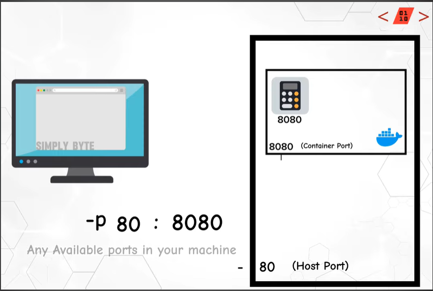
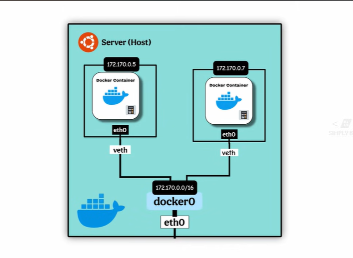
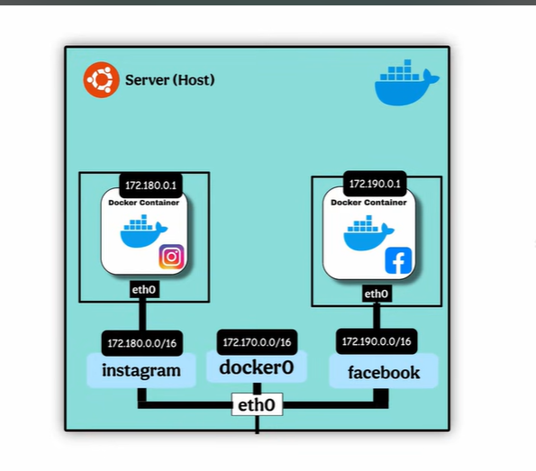

# Docker: Complete Study Guide

## Table of Contents
1. [Basics of Docker](#basics-of-docker)
2. [Docker Image](#docker-image)
3. [Docker Architecture](#docker-architecture)
4. [Docker Commands](#docker-commands)
5. [Port Explanation](#port-explanation)
6. [Docker Volume](#docker-volume)
7. [Bind Mount & Volume Mount](#docker-bind-mount--volume-mount)
8. [Dockerfile](#dockerfile)
9. [Docker Networking](#docker-networking)
10. [Docker Compose](#docker-compose-intro)
11. [Best Practices](#best-practices)
12. [Cleanup Commands](#cleanup-commands)

**Additional Resources:**
- [3-Tier Architecture Examples](3-tier-architecture.md) - Multiple real-world 3-tier setup examples
- [Django Docker Examples](django-example.md) - How to run Django applications with Docker

---

## Basics of Docker

### What is Docker?
- A tool to package your **application + everything** it needs into a container so it runs anywhere consistently
- Before Docker, applications ran differently on different systems due to dependency mismatches (Python version, libraries, etc.)
- **Flow**: `Code + Dependencies → Docker Image → Docker Engine → Container Runs`

### Simple Example

**Step 1: Create Application**
```
Python APP → print("Something")
```

**Step 2: Create Dockerfile**
```dockerfile
FROM python:3.10
COPY ./app .
WORKDIR /app
CMD ["python", "app.py"]
```

**Step 3: Build Image**
```bash
docker build -t myapp .
```

**Step 4: Run Container**
```bash
docker run myapp
```

**Step 5: Output**
```
Something
```

### Why Use Docker?
- ✅ **Faster deployment** - Seconds to boot
- ✅ **Smaller in size** - Lightweight containers vs full VMs
- ✅ **Shared OS** - Efficient resource usage
- ✅ **Consistency** - "Works on my machine" problem solved
- ✅ **Isolation** - Each container has its own environment

---

## Docker Image

### Overview
- A **read-only template** that contains everything needed to run your application
- Only changes are stored as new layers; existing layers are reused → Builds are fast + Images are lightweight
- **Process**: `Read Dockerfile line by line → Create layers → Save as Image`

### Image vs Container
- **Image** = "Template for what to run" (static)
- **Container** = "Running environment" (dynamic instance)

### Layer Structure
Docker images are built in layers for efficiency:

| Layer | Example |
|-------|---------|
| Layer 1 | Base OS (Ubuntu / Alpine) |
| Layer 2 | Language (Python / Java) |
| Layer 3 | Libraries (numpy, flask, etc.) |
| Layer 4 | Your Application Code |

**Key Point**: Since layers are reused, if you modify Layer 4, only that layer is rebuilt—Layers 1-3 are cached.

---

## Docker Architecture

Docker consists of **3 main components**:

### 1. Client
- The interface where you give instructions
- Communicates with Docker Daemon via REST API or Socket

### 2. Docker Host (Engine)

#### Docker Daemon (dockerd)
- The main worker process responsible for:
  - Building images
  - Running containers
  - Managing networks
  - Managing volumes

#### Rest API
- Communication bridge between Client ↔ Daemon
- Allows remote management

#### Docker Objects
Docker manages:
- **Images** - Templates for containers
- **Containers** - Running instances
- **Networks** - Container communication
- **Volumes** - Persistent storage

### 3. Docker Registry (Storage)
- Public or private repositories to pull/push images
- Example: [Docker Hub](https://hub.docker.com/)
- **Common commands**:
```bash
docker pull nginx                    # Pull image from registry
docker push myapp                    # Push image to registry
```

---

## Docker Commands

### Basic Information
```bash
docker --version                          # Check Docker version
docker --help                             # Get help
docker info                               # Get detailed Docker info
```

### Image Commands
```bash
docker images                             # List all images
docker build -t <tag-name> .             # Build image from Dockerfile (current directory)
docker build -t <tag-name> -f <path>    # Build image from specific Dockerfile
docker tag <image-name> <new-tag>        # Tag an existing image
docker rmi <image-name/image-id>         # Remove image
docker inspect <image-id>                # View image details
```

### Container Commands
```bash
docker run -p 8080:8080 <image-name>    # Run container with port mapping
docker ps                                # List running containers
docker ps -a                             # List all containers (running + stopped)
docker start <container-id>              # Start a stopped container
docker stop <container-id>               # Stop a running container
docker rm <container-id>                 # Remove a container
docker logs <container-id>               # View container logs
docker logs -f <container-id>            # Follow container logs (live)
docker exec -it <container-id> bash      # Access container shell
docker inspect <container-id>            # View container details
```

### Registry Commands
```bash
docker login                              # Login to Docker Hub
docker pull <repo>/<image>:<version>     # Pull image from registry
docker push <repo>/<image>:<version>     # Push image to registry
docker logout                            # Logout from Docker Hub
```

### Key Flags
| Flag | Meaning |
|------|---------|
| `-t` | Tag name |
| `-p` | Port mapping (host:container) |
| `-e` | Environment variable |
| `-d` | Detach mode (run in background) |
| `-v` | Volume mount |
| `-f` | Follow (for logs) |
| `-it` | Interactive terminal |
| `--name` | Container name | 


---

## Port Explanation

### Port Mapping
When running a container, you map your machine's port to the container's port:

```bash
docker run -p 80:8080 --name=myapp myimage:latest
```

### How It Works
- **Port**: Used for communication with the container
- **Host Port** (80): Your machine's port (exposed to you)
- **Container Port** (8080): Application port inside container
- **Flow**: Client (80) → Your Machine → Host Port 80 → Container Port 8080 → Application

**Example**: If you visit `localhost:80`, Docker routes you to port `8080` inside the container.




---

## Docker Volume

### Overview
- **Storage for Docker containers** that persists even when container crashes
- Managed entirely by Docker (stored on the host machine where Docker Daemon runs)
- **Cannot be accessed directly by the client** - only accessible through containers

### Volume Lifecycle
- Create → Attach to Container → Survives Container Deletion

### Volume Commands
```bash
docker volume create <volume-name>      # Create a new volume
docker volume ls                        # List all volumes
docker volume inspect <volume-name>     # View volume details
docker volume rm <volume-name>          # Remove a volume
docker volume prune                     # Remove unused volumes
```

### Running Container with Volume
```bash
docker run -p 80:8080 -v <volume-name>:/data <image-name>:<version>
```

**Explanation**:
- `/data` = Folder path inside the container
- `<volume-name>` = Docker-managed volume name
- Data stored in `/data` persists in the volume

**Example**:
```bash
docker volume create mydb-storage
docker run -p 5432:5432 -v mydb-storage:/var/lib/postgresql postgres:15
```
    

---

## Docker Bind Mount & Volume Mount

### Bind Mount Overview
- **Maps a directory** on your local machine ↔ Container directory
- **Client manages storage** (accessible/maintained by you)
- **Bidirectional**: Files added to local directory appear in container and vice versa

### Difference: Volume Mount vs Bind Mount

| Feature | Volume Mount | Bind Mount |
|---------|--------------|-----------|
| Managed by | Docker | User |
| Location | Docker's storage area | Any local directory |
| Accessible to | Only containers | User & containers |
| Persistence | Survives container deletion | Survives container deletion |
| Use case | Database data | Development, config files |

### Bind Mount Command
```bash
docker run -p 80:8080 -v <local-path>:<container-path> <image-name>:<version>
```

**Example:**
```bash
# Map local downloads folder to container /data folder
docker run -p 80:8080 -v C:/Downloads:/data calculaterapp:latest

# Now C:/Downloads is accessible as /data inside container
# Changes in C:/Downloads appear immediately in container
```

### When to Use
- **Bind Mount**: Development (hot reload), config files, code synchronization
- **Volume**: Production databases, sensitive data, long-term storage

---

## Dockerfile

### Overview
- A set of **instructions/commands** used to create a container with all necessary dependencies
- **Filename must be**: `Dockerfile`
- Each instruction creates a layer

### Instruction Execution
⚠️ **Important**: All commands execute during build time **EXCEPT** `CMD` - `CMD` runs when container starts

### Layer Structure - Detailed Example

```dockerfile
# Layer 1: Base OS
FROM ubuntu:22.04

# Layer 2: Language/Runtime
RUN apt-get update && apt-get install -y python3.10

# Layer 3: Create work directory
WORKDIR /app

# Layer 4: Copy project into image
COPY . .

# Layer 5: Install dependencies
RUN pip install numpy pandas flask

# Layer 6: Expose port (optional - documentation)
EXPOSE 5000

# Layer 7: Run application
CMD ["python3", "app.py"]
```

### Common Dockerfile Commands

| Command | Purpose | Runs at |
|---------|---------|---------|
| `FROM` | Set base image | Build time |
| `RUN` | Execute command | Build time |
| `COPY` | Copy files from host to container | Build time |
| `ADD` | Copy files (with URL support) | Build time |
| `WORKDIR` | Set working directory | Build time |
| `ENV` | Set environment variables | Build time & Runtime |
| `EXPOSE` | Document port (doesn't actually expose) | Documentation |
| `CMD` | Default command when starting container | Runtime |
| `ENTRYPOINT` | Configure container as executable | Runtime |
| `USER` | Set user for running commands | Runtime |

### Best Practices
1. Start with a minimal base image (`alpine` is smaller than `ubuntu`)
2. Order commands by change frequency (least to most changed)
3. Combine RUN commands with `&&` to reduce layers
4. Use `.dockerignore` to exclude unnecessary files
    

---

## Docker Networking

### Overview
- Enables communication between containers and host
- Each container has its own namespace (isolated network environment)
- **veth (Virtual Ethernet)**: Virtual link between container and host

### Network Modes

| Type | Description | Use Case |
|------|-------------|----------|
| **Bridge** (Default) | Container → Bridge → Host → Client | Isolated containers; multiple apps on one host |
| **Host** | Container → Host (no isolation) | High performance; direct host access |
| **None** | No network connection | Testing; disabled networking |

### Bridge Network Details
- When containers connect via bridge, the bridge assigns them IP addresses
- **IP Range**: `172.17.0.0/16` (default docker0 bridge)
- Multiple bridges help isolate applications from each other

**Architecture**: 
```
Client → Host → Bridge → Container Apps
```



### Network Isolation
- You can create multiple bridges to isolate applications
- Containers on the same network can communicate using container names
- Containers on different networks cannot communicate



### Example: Same Network (DB + Backend)

#### Step 1: Run MySQL Database
```bash
docker run -d --name mysql-db \
  -e MYSQL_ROOT_PASSWORD=pass \
  -e MYSQL_DATABASE=db \
  mysql:8
```

#### Step 2: Get Database Container IP
```bash
docker inspect mysql-db
# Look for: "IPAddress": "172.17.0.2"
# JDBC URL: jdbc:mysql://172.17.0.2:3306/db
```

#### Step 3: Run Backend Application (Same Default Bridge)
```bash
docker run -d -p 8090:8090 --name backend-app \
  -e SPRING_DATASOURCE_URL=jdbc:mysql://mysql-db:3306/db \
  myrepo/backend:latest
```

**Note**: On the same network, use **container-name** instead of IP address!

#### Step 4: Verify Connectivity
```bash
docker logs -f backend-app      # Follow logs
docker inspect backend-app      # Check configuration
```

### Example: Different Networks (Isolated)

When containers are on **different networks**, they **cannot communicate** by default.

#### Step 1: Create Two Networks
```bash
docker network create network-A
docker network create network-B
```

#### Step 2: Run Database on Network A
```bash
docker run -d --name mysql-db \
  --network network-A \
  -e MYSQL_ROOT_PASSWORD=pass \
  -e MYSQL_DATABASE=db \
  mysql:8
```

#### Step 3: Run Backend on Network B (Different Network - Won't Connect!)
```bash
docker run -d -p 8090:8090 --name backend-app \
  --network network-B \
  -e SPRING_DATASOURCE_URL=jdbc:mysql://mysql-db:3306/db \
  myrepo/backend:latest
```

**Result**: Backend cannot reach MySQL (but this is intentional for security/isolation)

### Network Commands
```bash
docker network create <network-name>          # Create custom network
docker network ls                             # List all networks
docker network inspect <network-name>         # View network details
docker network connect <network> <container>  # Connect running container to network
docker network disconnect <network> <container>  # Disconnect from network
docker network rm <network-name>              # Remove network
```

---

## Docker Compose Intro

### Overview
- **YAML-based tool** to define and run multi-container applications
- Eliminates need to run multiple `docker run` commands
- Perfect for: Database + Backend + Frontend setups

### Basic docker-compose.yml Example
```yaml
version: '3.8'

services:
  # MySQL Database Service
  mysql-db:
    image: mysql:8
    container_name: mysql-db
    environment:
      MYSQL_ROOT_PASSWORD: password
      MYSQL_DATABASE: myapp_db
    ports:
      - "3306:3306"
    volumes:
      - db_data:/var/lib/mysql

  # Backend Service
  backend:
    build: ./backend          # Build from Dockerfile in ./backend
    container_name: backend-app
    environment:
      SPRING_DATASOURCE_URL: jdbc:mysql://mysql-db:3306/myapp_db
    ports:
      - "8090:8090"
    depends_on:
      - mysql-db              # Start mysql-db first
    networks:
      - app-network

  # Frontend Service
  frontend:
    build: ./frontend
    container_name: frontend-app
    ports:
      - "3000:3000"
    depends_on:
      - backend
    networks:
      - app-network

volumes:
  db_data:

networks:
  app-network:
    driver: bridge
```

### Common Docker Compose Commands
```bash
docker-compose up                 # Start all services
docker-compose up -d              # Start in detached mode
docker-compose down               # Stop all services
docker-compose logs -f            # View combined logs
docker-compose ps                 # List services
docker-compose build              # Rebuild images before starting
```

---

## Best Practices

### 1. Image Building
- ✅ Use **minimal base images** (`alpine` instead of `ubuntu`)
- ✅ Combine RUN commands using `&&` to reduce layers
- ✅ Order Dockerfile instructions from least to most frequently changed
- ✅ Use `.dockerignore` to exclude unnecessary files

### 2. Security
- ✅ Don't run containers as root (use `USER` instruction)
- ✅ Use read-only filesystems when possible
- ✅ Regularly scan images for vulnerabilities
- ✅ Keep base images updated
- ✅ Don't store secrets in images (use environment variables or secrets)

### 3. Container Design
- ✅ **One process per container** (single responsibility)
- ✅ Use health checks to monitor container status
- ✅ Log to stdout/stderr (not files) for Docker to capture
- ✅ Use proper signal handling (SIGTERM) for graceful shutdown

### 4. Memory & Resources
- ✅ Set memory limits: `docker run -m 512m <image>`
- ✅ Set CPU limits: `docker run --cpus 1 <image>`
- ✅ Monitor with `docker stats`

### 5. Networking
- ✅ Use custom networks for app isolation
- ✅ Use container names for DNS resolution (same network)
- ✅ Expose only necessary ports

### 6. Data & Volumes
- ✅ Use volumes for persistent data (databases, logs)
- ✅ Use bind mounts for development (code synchronization)
- ✅ Avoid storing data in containers (non-persistent)

---

## Cleanup Commands

### Remove Stopped Containers
```bash
docker container prune              # Remove all stopped containers
docker rm <container-id>            # Remove specific container
docker rm -f <container-id>         # Force remove (even if running)
```

### Remove Images
```bash
docker image prune                  # Remove dangling images (untagged)
docker image prune -a               # Remove all unused images
docker rmi <image-id>               # Remove specific image
docker rmi -f <image-id>            # Force remove image
```

### Remove Volumes
```bash
docker volume prune                 # Remove unused volumes
docker volume rm <volume-name>      # Remove specific volume
```

### Remove Networks
```bash
docker network prune                # Remove unused networks
docker network rm <network-name>    # Remove specific network
```

### Complete Cleanup (Use Carefully!)
```bash
docker system prune                 # Remove unused containers, images, networks
docker system prune -a --volumes    # Also remove unused volumes
```

### View Disk Usage
```bash
docker system df                    # Show disk usage by Docker objects
```

---

## Common Troubleshooting

### Container won't start
```bash
docker logs <container-id>          # Check error logs
docker inspect <container-id>       # View configuration and mount points
```

### Cannot connect to database
```bash
docker exec <container-id> ping <service-name>      # Test DNS resolution
docker network inspect <network-name>               # Check connected services
```

### Port already in use
```bash
# Change port mapping
docker run -p 8081:8080 <image>    # Use port 8081 instead

# Or find what's using the port
netstat -ano | findstr :8080       # Windows
lsof -i :8080                      # Mac/Linux
```

### Out of disk space
```bash
docker system prune -a --volumes    # Clean up unused resources
docker image prune                  # Remove dangling images
```
        